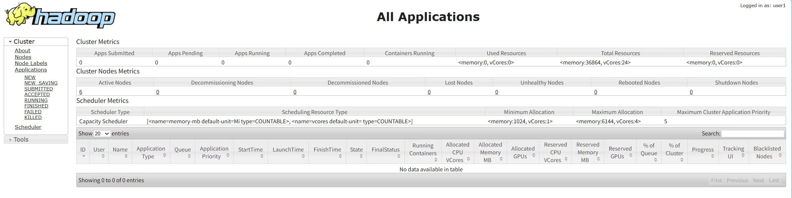

# PageRank 算法在 Giraph 与 MapReduce 中的对比分析

```
.
├── code/                   # 核心实现代码
│   ├── giraph/             # Giraph版本的PageRank算法实现
│   └── mapreduce/          # MapReduce版本的PageRank算法实现
│
├── Analysis/               # 实验数据、脚本与结果分析
│   │
│   ├── Giraph_S1/          # Giraph小规模数据集场景(Web-Google)
│   │   ├── metrics_node100.csv # 节点100的资源监控原始数据
│   │   ├── metrics_node101.csv # ...
│   │   ├── ...
│   │   └── metrics_node105.csv # 节点105的资源监控原始数据
│   │
│   ├── Giraph_S1_Figure/   # Giraph小规模数据集场景的分析图表与摘要
│   │   ├── cpu_iowait.png       # CPU的IO等待时间图
│   │   ├── cpu_usage.png        # CPU利用率图
│   │   ├── disk_write_mbs.png   # 写磁盘监控图
│   │   ├── memory_used_gb.png   # 内存使用量图
│   │   ├── network_send_mbs.png # 网络使用图
│   │   └── summary.csv          # 该场景下性能指标的摘要数据
│   │
│   ├── Giraph_S2/          # Giraph中规模数据集场景(soc-Pokec)
│   ├── Giraph_S2_Figure/   # Giraph中规模数据集场景的分析图表与摘要
│   ├── Giraph_S3/          # Giraph大规模数据集场景(LiveJournal)
│   ├── Giraph_S3_Figure/   # Giraph大规模数据集场景的分析图表与摘要
│   │
│   ├── MapReduce_S1/       # MapReduce小规模数据集场景(Web-Google)
│   │   ├── metrics_node100.csv
│   │   ├── ...
│   │   ├── metrics_node105.csv
│   │   └── performance_report.txt # MapReduce性能分析脚本生成的文本报告
│   │
│   ├── MapReduce_S1_Figure/ # MapReduce小规模数据集场景的分析图表与分析报告
│   │   ├── cpu_iowait.png
│   │   ├── cpu_usage.png
│   │   ├── disk_write_mbs.png
│   │   ├── memory_used_gb.png
│   │   ├── network_send_mbs.png
│   │   └── summary.csv
│   │
│   ├── MapReduce_S2/        # MapReduce中规模数据集场景(soc-Pokec)
│   ├── MapReduce_S2_Figure/ # MapReduce中规模数据集场景的分析图表与分析报告
│   ├── MapReduce_S3/        # MapReduce大规模数据集场景(LiveJournal)
│   ├── MapReduce_S3_Figure/ # MapReduce大规模数据集场景的分析图表与分析报告
│   │
│   ├── cluster_monitor.sh            # 用于在集群各节点收集资源利用率数据
│   ├── plot_cpu.py                   # 绘制CPU使用率、IO等待等相关图表
│   ├── plot_gantte_giraph.py         # 绘制Giraph任务执行的甘特图
│   └── plot_mapreduce_performance.py # 分析MapReduce日志并生成性能图表和报告
│
└── README.md               # 项目核心说明文档
```

## 1. 研究目的
比较Giraph和MapReduce运行PageRank算法的差异。

## 2. 研究内容
对比分析Giraph和MapReduce在执行PageRank图迭代计算任务时的差异。

**具体研究内容包括：**
1.  **编程模型对比：** 分析MapReduce的 "Map-Shuffle-Reduce" 批处理模型与Giraph的 "Vertex-centric"（以顶点为中心）编程模型的表达差异。
2.  **执行机制剖析（重点增加内容）：**
    *   **数据通信方式：** 对比MapReduce基于磁盘的Shuffle机制与Giraph基于内存的消息传递机制。
    *   **任务调度与迭代开销：** 探讨MapReduce"每次迭代启动新Job"的模式与Giraph"Superstep（超步）长驻内存" 模式在时间成本上的根本区别。
    *   **资源利用特征：** 分析两者在CPU、内存、磁盘 I/O和网络带宽上的占用趋势。
3.  **性能与扩展性评估：** 在不同规模的数据集上，量化分析两者的运行时间、加速比及系统瓶颈。

## 3. 实验

### 3.1 实验环境

#### 3.1.1 硬件配置
集群由6个节点组成（1 Master + 5 Slaves），采用虚拟机混合部署模式。
*   **节点数量：** 6 节点
*   **CPU：** 4 核 (vCPU) / 节点
*   **内存：** 8 GB / 节点
*   **存储：** 50 GB SSD / 节点
*   **网络带宽：** 1 Gbps (桥接模式，千兆局域网)

#### 3.1.2 软件环境
*   **操作系统：** CentOS Linux release 7.x
*   **JDK版本：** Java 1.8.0_291
*   **Hadoop版本：** Apache Hadoop 2.10.1 (YARN + HDFS)
*   **Giraph版本：** Apache Giraph 1.3.0

### 3.2 实验负载

#### 3.2.1 数据集

本实验使用[Stanford Large Network Dataset Collection](https://snap.stanford.edu/data/index.html) 的真实图数据集，覆盖从小规模到大规模的多种场景。


| 数据规模 | 数据集名称     | 数据集描述                         | 数据集地址                                                                                                                                     | 顶点数   | 边数    | 文件大小 | 特性说明                                                                 |
|----------|----------------|------------------------------------|------------------------------------------------------------------------------------------------------------------------------------------------|----------|---------|--------------------|--------------------------------------------------------------------------|
| 小       | **Web-Google**     | 2002年Google网页链接图             | [https://snap.stanford.edu/data/web-Google.txt.gz](https://snap.stanford.edu/data/web-Google.txt.gz)                                           | 875k     | 5.1M    | 78MB      | 典型网页图：具有高度偏斜的入度分布（枢纽页面现象），平均出度较低（约5.8），适合初步验证框架基本功能。 |
| 中       | **soc-Pokec**      | Slovakia在线社交网络               | [https://snap.stanford.edu/data/soc-pokec-relationships.txt.gz](https://snap.stanford.edu/data/soc-pokec-relationships.txt.gz)                 | 1.6M     | 31M     | 404MB      | 高密度社交图：边密度较高（平均度约18.8），入度与出度均显著偏斜，挑战并行系统的负载均衡与通信效率。 |
| 大       | **LiveJournal**    | LiveJournal用户好友关系图          | [https://snap.stanford.edu/data/soc-LiveJournal1.txt.gz](https://snap.stanford.edu/data/soc-LiveJournal1.txt.gz)                               | 4.8M     | 69M     | 1.01GB     | 大规模超级节点：出度偏斜极高（76.0），易引发 MapReduce 的热点键问题或 Giraph 的内存压力，用于性能评测。 |


#### 3.2.2 工作负载

**PageRank参数设置：** 
*   **阻尼系数 (Damping Factor)：** 0.85
*   **最大迭代次数 (Max Iterations)：** 100
*   **收敛阈值：** 1e-4 

### 3.3 实验步骤

#### 3.3.1 环境部署与验证

Hadoop集群：
<p align="center">
  
  <br>
  <em>Hadoop集群展示</em>
</p>
Node展示：
<p align="center">
  
  <br>
  <em>Node展示</em>
</p>


启动Hadoop集群与Giraph环境，确保节点间通信正常。


<p align="center">
  
  <br>
  <em>集群节点进程运行状态</em>
</p>

#### 3.3.2 MapReduce PageRank 运行
执行MapReduce作业，监控Job链的执行情况。由于MapReduce每次迭代是一个独立的Job，控制台会输出一系列Job ID。

**[此处插入截图：MapReduce 连续提交 Job 的控制台日志截图]**
*图 2：MapReduce迭代过程中的Job提交日志*

#### 3.3.3 Giraph PageRank 运行
执行Giraph作业，监控Superstep的执行进度。

**[此处插入截图：Giraph 作业执行成功的最终日志（显示 Total time 和 Supersteps 信息）]**
*图 3：Giraph作业执行完成信息（Web-Google数据集示例：Total time ≈ 29.4s）*

### 3.4 实验结果与分析

**<u>待贴图，MapReduce和Giraph两种分布式架构算法执行流程</u>**

#### 3.4.1 迭代开销与总耗时对比

在中等规模数据集下，我们分别记录MapReduce每次迭代（即每个 Job）的启动、Map、Shuffle和Reduce时间，以及Giraph运行整个作业的Setup时间、每个Superstep的计算时间、通信时间。

**[此处插入图表：全流程时间轴对比图 (Gantt-style) 或 堆叠柱状图]**

**分析：**
*   **MapReduce的瓶颈：** 实验结果显示，MapReduce在每一次迭代之间存在显著的“间隙”。这是因为每次迭代都需要重新启动JVM (Job Setup)、调度资源，并在迭代结束时将中间结果写入HDFS(Disk I/O)。这种“启停式”工作流导致了巨大的系统开销。
*   **Giraph的优势：** 相比之下，Giraph仅在作业开始时加载一次图数据（Graph Loading）。随后的Supersteps中，所有计算均在内存中进行，且利用BSP模型仅在Superstep结束时进行必要的网络同步。
*   **数据佐证：** 在Web-Google数据集上，Giraph完成11轮迭代仅耗时 **29.4秒**，平均每轮计算+同步仅需 **1.5-2秒**；而MapReduce单次迭代的启动和I/O开销往往就超过了这一数值。

#### 3.4.2 数据规模扩展性测试

在不同规模数据集上运行PageRank，以观察性能变化趋势。

**[此处插入图表：总运行时间对比柱状图 (X轴为数据集大小，Y轴为时间)]**

**分析：**
*   随着数据量从Web-Google增加到LiveJournal，MapReduce的运行时间呈近乎线性的增长，主要受限于磁盘I/O吞吐量。
*   Giraph在内存充足的情况下，性能表现极其优异，增长曲线平缓。但在处理超大规模图（如接近内存极限）时，需要注意内存溢出风险。

#### 3.4.3 系统资源监控分析

通过监控工具记录作业运行期间的资源使用情况。

##### I/O监控对比

<p align="center">
  <table>
    <tr>
      <td align="center">
        
        <br>
        <em>MapReduce磁盘写入</em>
      </td>
      <td align="center">
        
        <br>
        <em>Giraph磁盘写入</em>
      </td>
    </tr>
  </table>
</p>

**分析：** MapReduce呈现典型的“锯齿状”磁盘I/O波峰，对应每轮Map的读取和Reduce的写入。Giraph则在计算过程中磁盘I/O极低，但在Superstep同步阶段会出现网络流量峰值。

##### Memory监控对比

*   **MapReduce：** 内存使用呈波浪形，Job结束即释放，不依赖内存容量大小。
*   **Giraph：** 内存使用呈“梯形”，加载数据后一直维持高位直到作业结束，说明Giraph是典型的“空间换时间”策略，其性能和有效性取决

**[此处插入图表：内存与 I/O 监控时序图]**

**分析：**
*   **I/O模式差异：** MapReduce呈现典型的“锯齿状”磁盘I/O波峰，对应每轮Map的读取和Reduce的写入。Giraph则在计算过程中磁盘I/O极低，但在Superstep同步阶段会出现网络流量峰值。
*   **内存模型差异：**
    *   **MapReduce：** 内存使用呈波浪形，Job结束即释放，不依赖内存容量大小。
    *   **Giraph：** 内存使用呈“梯形”，加载数据后一直维持高位直到作业结束，说明Giraph是典型的“空间换时间”策略，其性能和有效性取决于内存容量。

### 3.5 结论

1.  **效率差异显著：** Giraph得益于BSP模型和内存常驻机制，避免了MapReduce频繁的磁盘I/O和JVM启动开销，在图迭代计算任务上比MapReduce快**一个数量级**（通常 10-50 倍）。
2.  **适用场景不同：**
    *   **Giraph** 适合需多次迭代的复杂图算法，但对集群内存资源有硬性要求（图数据需能放入内存）。
    *   **MapReduce** 虽然速度慢，但基于磁盘的特性使其具有极强的容错性和对超大数据集（超出内存限制）的处理能力，适合一次性ETL或非迭代任务。
3.  **架构权衡：** 实验验证了从“以磁盘为中心”向“以内存为中心”的计算范式转变，能够显著提升大规模图处理的性能。

---

## 4. 小组分工

| 姓名        | 学号 | 具体工作与贡献 | 贡献度排序 |
|:----------| :--- | :--- | :--- |
| **[姓名A]** | [学号] | 1. 负责 Giraph 环境搭建与调试<br>2. 编写 Giraph PageRank 代码<br>3. 撰写实验结果分析部分 | 1 |
| **[姓名B]** | [学号] |  | 2 |
| **[姓名C]** | [学号] |  | 3 |
| **[姓名D]** | [学号] |  | 4 |