# PageRank算法在Giraph与MapReduce中的对比分析

```
.
├── code/                              # 核心代码目录
│   ├── PageRankGiraph/                # 基于Giraph的PageRank算法实现
│   │   ├── src/main/java/edu/practice/pagerank    # Java源代码
│   │   ├── target/                    # 编译后的输出目录
│   │   ├── pom.xml                    # 依赖配置文件
│   │   └── run_pagerank.sh            # Giraph运行脚本
│   │
│   └── PageRankMapReduce/             # 基于MapReduce的PageRank算法实现
│   │   ├── src/main/java/edu/practice/pagerank    # Java源代码
│   │   ├── target/                    # 编译后的输出目录
│   │   └── pom.xml                    # 依赖配置文件
│
├── img/                               # 存放README文档引用的图片资源
└── README.md                          # 项目说明文档
```

## 1. 研究目的
比较Giraph和MapReduce运行PageRank算法的差异。

## 2. 研究内容
对比分析Giraph和MapReduce在执行PageRank算法等图迭代计算任务时的差异，深入理解Giraph所采用的BSP（Bulk Synchronous Parallel）模型的设计理念及其在图计算中的优势。 

重点探讨两者在数据通信方式、任务调度机制及迭代开销等方面的不同，以及这些差异对算法性能与可扩展性的影响。

### 2.1. PageRank算法介绍

#### 2.1.1. 算法概述
PageRank算法是由Google创始人Larry Page和Sergey Brin提出的一种基于图论的链接分析算法，旨在量化有向图中节点的重要性，最初被应用于搜索引擎的信息检索中，用于对网页进行相关性排序。

#### 2.1.2. 核心思想：图抽象与递归定义
PageRank将万维网抽象为一个有向图$G=(V, E)$ ，其中：
*   **节点 (Vertex)**：代表互联网中的网页。
*   **有向边 (Directed Edge)**：代表网页间的超链接。若网页 $p_i$ 包含指向 $p_j$ 的链接，则存在一条边 $p_i \rightarrow p_j$。

算法的核心逻辑遵循 **“引用即投票”** 的原则：一个网页的重要性（即 PageRank 值）不取决于其自身的内容信息，而是由指向该网页的其他网页的权重递归决定。简而言之，一个被高权重网页链接的页面，其自身也将获得更高的权重。

#### 2.1.3. 数学模型：随机游走与马尔可夫链
引入 **“随机游走模型” (Random Surfer Model)** 计算网络中各节点的权重分布，即模拟了一个虚拟用户在互联网上的浏览行为： 在浏览当前网页时，有较大概率点击页面上的超链接，跳转至下一个页面；也有一定概率不再点击当前链接，而是随机输入网址跳转到网络中的任意一个新页面。

这一浏览过程构成了一个离散时间的 **马尔可夫链 (Markov Chain)**。随着迭代次数的增加，网页的访问概率分布将逐渐趋于稳定。

#### 2.1.4. 计算公式
对任意网页 $p_i$，其 PageRank 值 $PR(p_i)$ 的迭代计算公式如下：

$$
PR(p_i) = \frac{1-d}{N} + d \sum_{p_j \in M(p_i)} \frac{PR(p_j)}{L(p_j)}
$$

其中，
*   **$PR(p_i)$**：网页 $p_i$ 的 PageRank 值（即重要性权重）。
*   **$PR(p_j)$**：指向网页 $p_i$ 的网页 $p_j$ 的 PageRank 值。
*   **$M(p_i)$**：所有指向网页 $p_i$ 的网页集合（入链集合）。
*   **$L(p_j)$**：网页 $p_j$ 的出链数量（Out-degree）。
*   **$N$**：网络中网页的总数量。
*   **$d$**：**阻尼系数 (Damping Factor)**，通常取值为 **0.85**。代表用户通过点击链接继续浏览的概率，$(1-d)$ 代表用户随机跳转到新页面的概率，以解决“死循环”导致的收敛问题。

### MapReduce介绍
Apache Hadoop MapReduce是一个分布式计算框架，旨在对海量数据进行高吞吐量的批处理。它采用“分而治之”的策略，将计算任务抽象为 **Map（映射）** 和 **Reduce（归约）** 两个阶段，通过分布式文件系统（HDFS）进行数据交换。不同于Giraph的内存驻留模式，MapReduce是无状态的，依靠磁盘I/O实现容错和数据传输。

执行流程：
* **作业链控制**：由于MapReduce本质是非迭代的，PageRank的每一次迭代对应一个独立的MapReduce Job，由驱动程序（Driver）循环提交。
* **Map阶段**：
  - 读取图结构，保留图的拓扑信息（传递节点结构）。
  - 根据当前PageRank值，向出链指向的邻居节点“分发”贡献值（$PR/OutDegree$）。
* **Shuffle阶段**：
  - 系统自动将发往同一个目标节点的图结构数据和PR贡献值汇聚到一起。
* **Reduce阶段**：
  - 累加所有通过入链传递来的贡献值。
  - 应用阻尼系数公式计算新的PageRank值。
  - 将新的PR值与图结构合并，写入HDFS，作为下一轮Job的输入。


### Giraph介绍
Apache Giraph是一个基于Hadoop的迭代图处理系统，专门为大规模图计算而设计。它实现了Google Pregel的编程模型，采用BSP (Bulk Synchronous Parallel)计算模型，能够高效处理包含数十亿顶点和数万亿边的超大规模图数据。

执行流程：
* **初始化**：所有顶点分配初始PageRank值
* **超步迭代**：
  - 每个顶点接收来自其他顶点的PageRank值
  - 计算新的PageRank值
  - 向邻居顶点发送更新值
* **同步屏障**：等待所有顶点完成计算
* **迭代终止**：达到最大迭代次数或收敛


## 3. 实验

### 3.1 实验环境

#### 3.1.1 硬件配置
集群由6个节点组成（1 Master + 5 Slaves），采用虚拟机混合部署模式。
*   **节点数量：** 6 节点
*   **CPU：** 4 核 (vCPU) / 节点
*   **内存：** 8 GB / 节点
*   **存储：** 50 GB SSD / 节点
*   **网络带宽：** 1 Gbps (桥接模式，千兆局域网)

#### 3.1.2 软件环境
*   **操作系统：** CentOS Linux release 7.x
*   **JDK版本：** Java 1.8.0_291
*   **Hadoop版本：** Apache Hadoop 2.10.1 (YARN + HDFS)
*   **Giraph版本：** Apache Giraph 1.3.0


### 3.2 实验负载

#### 3.2.1 数据集

本实验使用[Stanford Large Network Dataset Collection](https://snap.stanford.edu/data/index.html) 的真实图数据集，覆盖从小规模到大规模的多种场景。


| 数据规模 | 数据集名称     | 数据集描述                         | 数据集地址                                                                                                                                     | 顶点数   | 边数    | 文件大小 | 特性说明                                                                 |
|----------|----------------|------------------------------------|------------------------------------------------------------------------------------------------------------------------------------------------|----------|---------|--------------------|--------------------------------------------------------------------------|
| 小       | **Web-Google**     | 2002年Google网页链接图             | [https://snap.stanford.edu/data/web-Google.txt.gz](https://snap.stanford.edu/data/web-Google.txt.gz)                                           | 875k     | 5.1M    | 78MB      | 典型网页图：具有高度偏斜的入度分布（枢纽页面现象），平均出度较低，适合初步验证框架基本功能。 |
| 中       | **soc-Pokec**      | Slovakia在线社交网络               | [https://snap.stanford.edu/data/soc-pokec-relationships.txt.gz](https://snap.stanford.edu/data/soc-pokec-relationships.txt.gz)                 | 1.6M     | 31M     | 404MB      | 高密度社交图：边密度较高，入度与出度均显著偏斜，挑战并行系统的负载均衡与通信效率。 |
| 大       | **LiveJournal**    | LiveJournal用户好友关系图          | [https://snap.stanford.edu/data/soc-LiveJournal1.txt.gz](https://snap.stanford.edu/data/soc-LiveJournal1.txt.gz)                               | 4.8M     | 69M     | 1.01GB     | 大规模超级节点：出度偏斜极高，易引发 MapReduce 的热点键问题或 Giraph 的内存压力，用于性能评测。 |


#### 3.2.2 工作负载

**PageRank参数设置：** 
*   **阻尼系数 (Damping Factor)：** 0.85
*   **最大迭代次数 (Max Iterations)：** 100
*   **收敛阈值：** 1e-8 

### 3.3 实验步骤

#### 3.3.1 环境部署与验证

Hadoop集群：
<p align="center">
  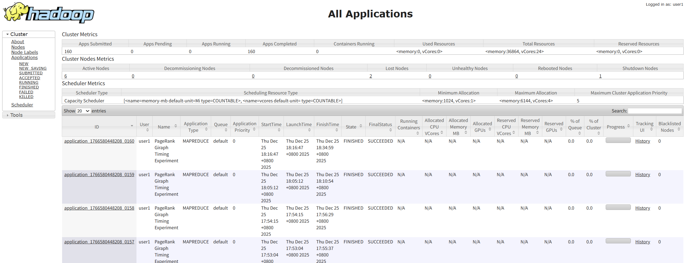
  <br>
  <em>Hadoop集群展示</em>
</p>
Node展示：
<p align="center">
  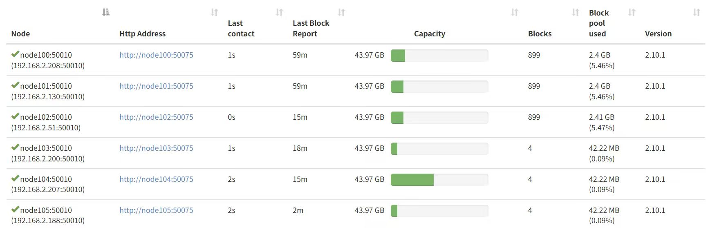
  <br>
  <em>Node展示</em>
</p>


启动Hadoop集群与Giraph环境，确保节点间通信正常。


<p align="center">
  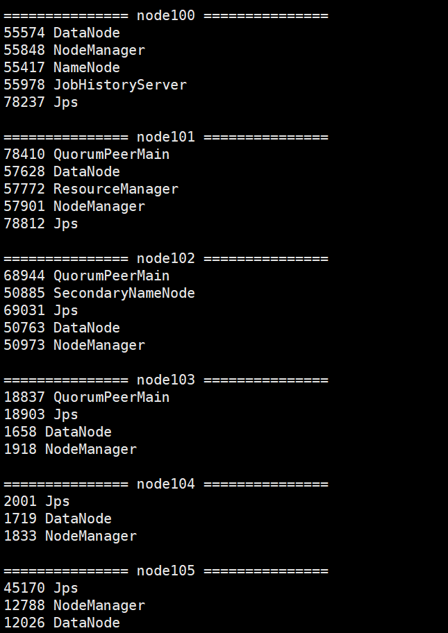
  <br>
  <em>集群节点进程运行状态</em>
</p>

#### 3.3.2 MapReduce PageRank 运行
执行MapReduce作业，监控Job链的执行情况。由于MapReduce每次迭代是一个独立的Job，控制台会输出一系列Job ID。
<p align="center">
  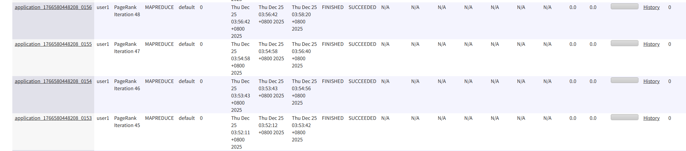
  <br>
  <em>MapReduce运行示意图</em>
</p>

#### 3.3.3 Giraph PageRank 运行
执行Giraph作业，监控执行情况。

<p align="center">
  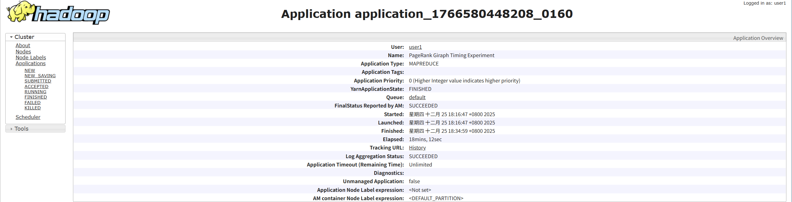
  <br>
  <em>Giraph执行情况示意图</em>
</p>


### 3.4 实验结果与分析

#### 3.4.1 迭代开销

在小、中、大三种规模数据集下，我们分别记录MapReduce前4次迭代的启动、Map、Reduce(含shuffle)和IO执行时间，以及Giraph运行整个作业的Setup、前4个Superstep的运行时间。

**Mapreduce**
<p align="center">
  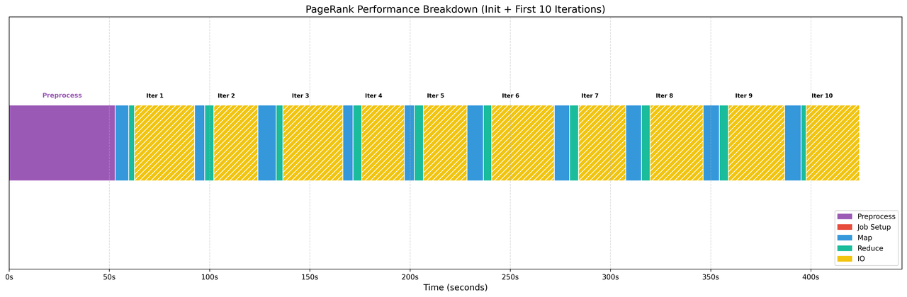
  <br>
  <em>MapReduce在小规模数据集下的前4轮迭代结果</em>
</p>

<p align="center">
  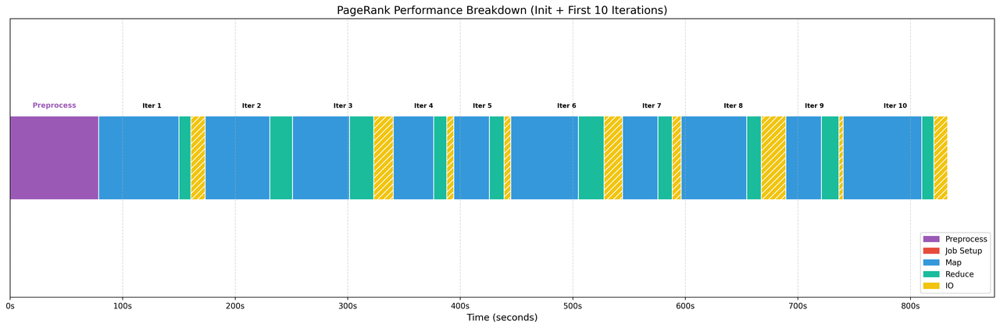
  <br>
  <em>MapReduce在中规模数据集下的前4轮迭代结果</em>
</p>

<p align="center">
  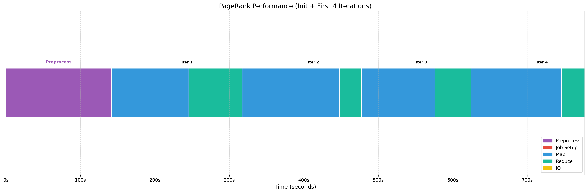
  <br>
  <em>MapReduce在大规模数据集下的前4轮迭代结果</em>
</p>

* 小规模数据集下，MapReduce 的时间流水线呈现出显著的“低计算密度”特征。IO占比最为突出，显著长于Map和Reduce阶段。
* 随着数据规模扩展至大规模，图表中几乎看不到黄色的 IO 条带，取而代之的是极宽的Map和Reduce计算条带，总迭代时间大幅拉长，但时间主要在计算阶段中。

**分析：**

  * **小规模数据集下以I/O延迟为主导**：由于实际需要计算的数据量很小，计算逻辑快速完成，MapReduce 框架的固有管理开销（初始化、同步、落盘）占据了主导地位，此时表现为“框架受限（Framework-bound）”而非“计算受限”。
  * **扩展至中、大规模数据集后计算耗时掩盖I/O开销**：大规模数据下，Mapper 需要处理海量的节点计算，Reducer 需要聚合庞大的边权重，导致CPU 计算时间大幅膨胀。因此，虽然绝对的 I/O 数据量增加了，但相对于被极大拉长的计算/处理时间，框架的调度与合并开销被摊薄了，此时，系统的瓶颈逐渐向“计算/处理能力受限”转移。

**Giraph**

<p align="center">
  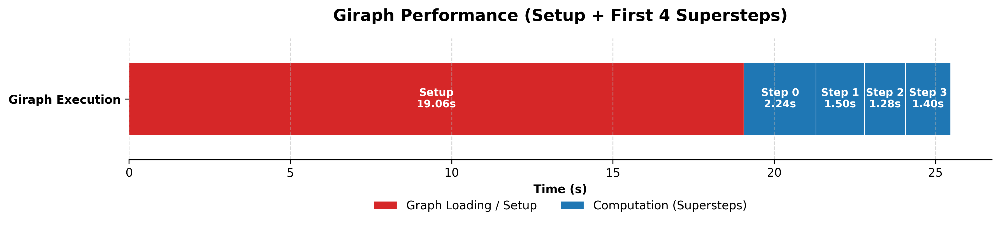
  <br>
  <em>Giraph在小规模数据集下的前4轮迭代结果</em>
</p>

<p align="center">
  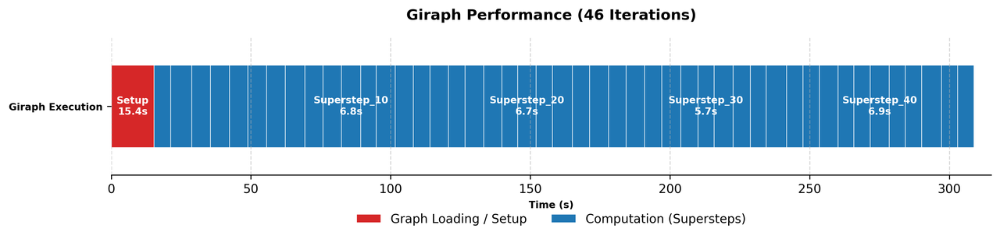
  <br>
  <em>Giraph在中规模数据集下的前4轮迭代结果</em>
</p>

<p align="center">
  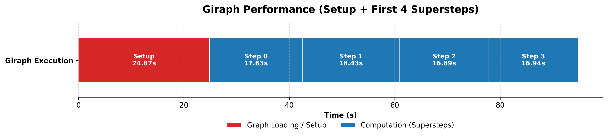
  <br>
  <em>Giraph在大规模数据集下的前4轮迭代结果</em>
</p>

* 小规模数据集下，Giraph的Setup耗时为19.06秒，随后的单次超步（Superstep）计算仅需约1.2秒。Setup阶段的时间约为单次计算时间的15倍以上。
* 随着数据规模扩大，Giraph的Setup时间并未显著增长，而单次超步时间线性增长至约17秒。尽管如此，流水线依然保持着极高的计算密度，超步之间紧密衔接，无明显间隙。

**分析：**

  * **小规模数据集下以启动成本为主导**： 此时Giraph的性能主要受限于一次性的图构建成本。虽然BSP模型的内存计算极快，但在计算开始前，必须将所有顶点和边从磁盘并行加载到内存并建立拓扑结构。对于小图而言，这种“冷启动”时间远超算法快速收敛所需的计算时间，体现了图计算系统在小规模任务上的“预热”代价。
  * **扩展至中、大规模数据集后具有高计算密度与优异的扩展性**：随着图规模增大，Setup的时间被后续几十轮的迭代计算有效分摊，不再是主要矛盾。系统能够充分利用内存带宽和网络通信能力，维持高效的连续计算流。只要内存足够，其在处理大规模复杂图结构时具有绝对优势。

#### 3.4.2 数据规模扩展性测试

依次使用小规模、中规模、大规模节点的数据集运行算法，分析数据量增加时，两者性能下降的趋势。

<p align="center">
  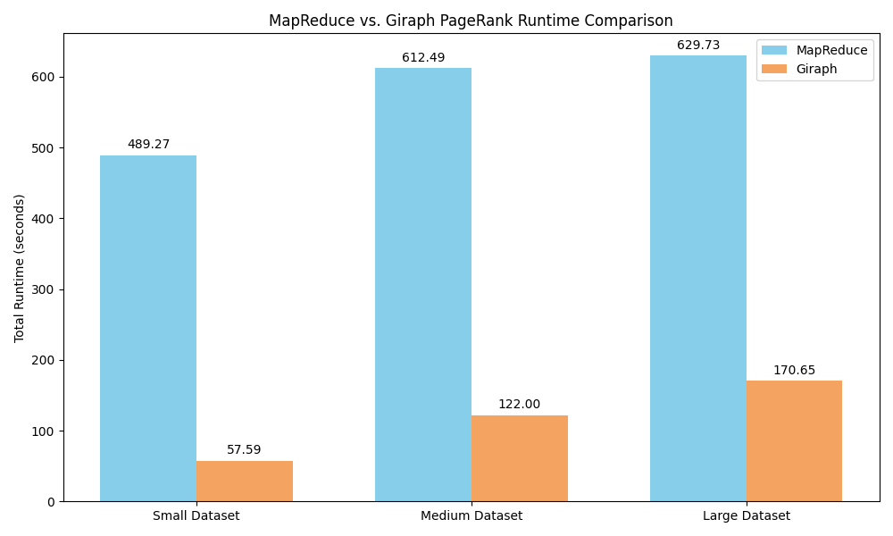
  <br>
  <em>MapReduce和Giraph在不同规模数据集下的总运行时间对比示意图</em>
</p>

<p align="center">
  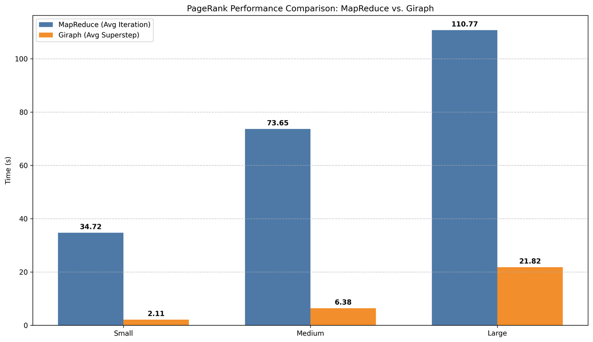
  <br>
  <em>MapReduce和Giraph在不同规模数据集下的平均迭代时间对比示意图</em>
</p>

* 从总运行时间来看，Giraph的效率较MapReduce高。以大规模数据集为例，MapReduce的总耗时高达629秒，而Giraph仅需170秒。
* 从平均单次迭代/超步时间来看，以大规模数据集为例，MapReduce的单次迭代耗时（约131秒）远高于Giraph的平均超步耗时（约17秒），Giraph的迭代性能约为MapReduce的7.7倍。

**分析：** 
* **MapReduce的局限性**：MapReduce必须在每次迭代结束时将中间结果写入磁盘（HDFS），并在下一次迭代开始时重新读取和Shuffle。这种频繁的磁盘I/O开销和序列化/反序列化成本，导致了图中所示的高昂平均迭代时间。
* **Giraph的优势**：Giraph基于BSP模型和以顶点为中心的编程范式，将图结构驻留在内存中，迭代之间仅通过网络传输必要的消息更新，避免了冗余的磁盘读写，故能以极低的延迟完成超步计算。

#### 3.4.3 系统资源监控分析

通过监控工具记录作业运行期间的资源使用情况。

##### 磁盘写入分析

<p align="center">
  <table>
    <tr>
      <td align="center">
        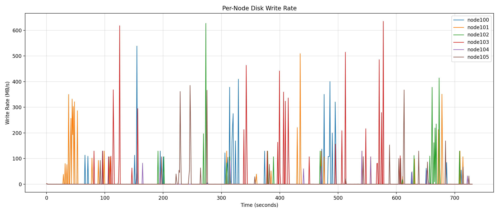
        <br>
        <em>MapReduce磁盘写入</em>
      </td>
      <td align="center">
        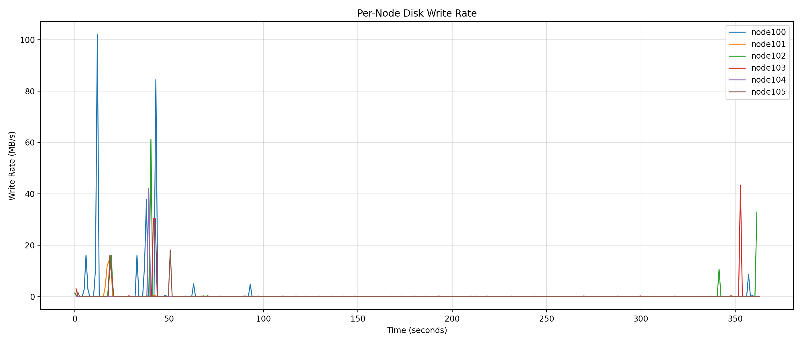
        <br>
        <em>Giraph磁盘写入</em>
      </td>
    </tr>
  </table>
</p>

* **MapReduce:** MapReduce作业在执行过程中，其磁盘监控图呈现出高频且密集的“锯齿状”波峰。写速率反复突破400MB/s，这种高强度的I/O震荡持续了整个运行周期，大约600秒。这一现象主要由MapReduce的工作机制决定：每轮迭代中，Map端会溢写中间数据到磁盘，随后Reduce端需要从这些临时文件中读取并处理数据，最终将结果落盘。因此，频繁的磁盘序列化和反序列化操作成为系统瓶颈，导致I/O性能受到显著影响。
* **Giraph:** Giraph的磁盘I/O曲线极为平缓，整个计算过程仅耗时约70秒。除了在作业启动（Setup阶段加载图）和结束（结果输出）时出现短暂且幅度较低的波峰（约90MB/s），中间核心计算阶段的磁盘写入量几乎为零。这表明Giraph采用了纯内存计算模式，所有顶点状态、边信息以及消息队列均驻留在内存中。数据一旦被加载后，所有的超步（Superstep）状态更新都在RAM中完成，极大地减少了对外部存储的依赖，从而提高了计算效率。

**总结：** MapReduce的密集波峰对应了每轮迭代中Map端溢写中间数据与Reduce端落盘最终状态的强制过程，频繁的磁盘序列化成为了系统瓶颈。而Giraph中间阶段的“I/O静默”证实了其内存驻留特性：数据一次加载后，所有超步的状态更新均在RAM中完成。

##### Network对比分析
<p align="center">
  <table>
    <tr>
      <td align="center">
        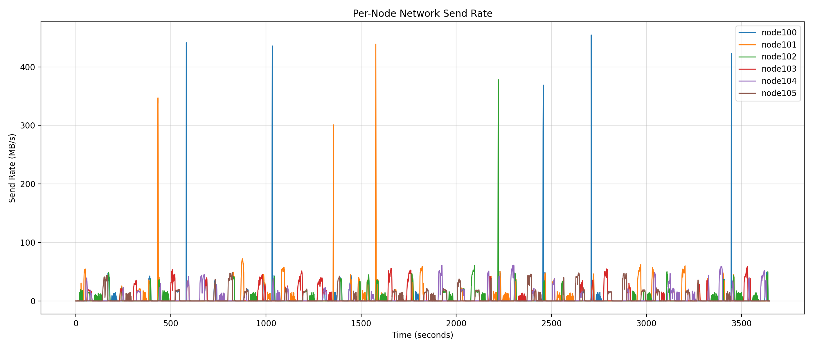
        <br>
        <em>MapReduce Network使用</em>
      </td>
      <td align="center">
        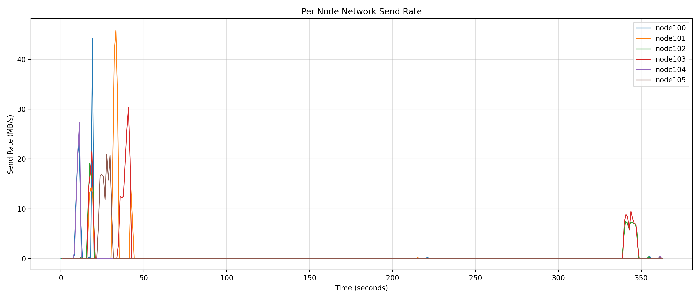
        <br>
        <em>Giraph Network使用</em>
      </td>
    </tr>
  </table>
</p>

* **MapReduce:** MapReduce的网络通信主要集中在 Shuffle 阶段，表现为短暂而集中的数据传输高峰。在任务执行的大部分时间内，各节点网络活动较低且均衡；仅在 Map 输出向 Reduce 节点传输时出现短时高带宽使用。这种“批处理式”通信模式具有低频、阶段性、总量可控的特点，整体网络压力较小，适合大规模离线数据处理。

* **Giraph:** Giraph 基于 Pregel 的迭代计算模型，其网络使用呈现高频、周期性的脉冲特征。每个超步（Superstep）结束后，活跃顶点需向邻居发送消息，导致全集群节点几乎同步产生通信峰值。这种“心跳式”通信强度高、持续时间长，且部分高连接度节点负载更重，使得网络成为性能关键瓶颈，对带宽和延迟更为敏感。

**总结：** MapReduce 以阶段性、低频通信为主，网络开销集中但总体可控；Giraph 则因迭代式图计算带来持续、高频的全网消息交换，网络负载显著更高。两者通信模式的根本差异源于其计算范式——前者面向批处理，后者面向状态同步的图遍历，因此在系统部署与调优中需采取截然不同的网络资源管理策略。
##### CPU利用率对比分析
<p align="center">
  <table>
    <tr>
      <td align="center">
        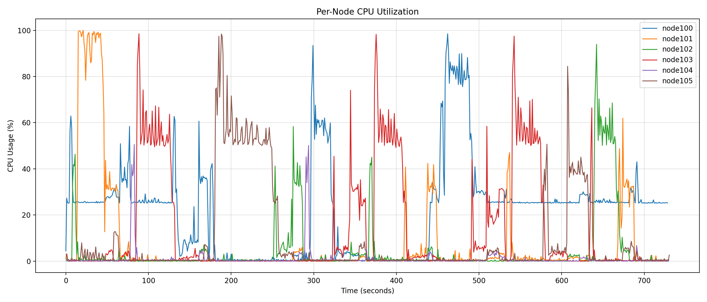
        <br>
        <em>MapReduce CPU利用率</em>
      </td>
      <td align="center">
        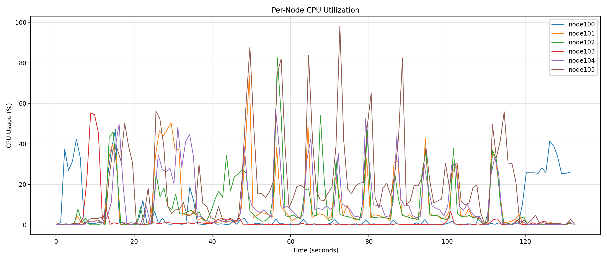
        <br>
        <em>Giraph CPU利用率</em>
      </td>
    </tr>
  </table>
</p>

* **MapReduce:** MapReduce 的 CPU 利用率呈现明显的阶段性特征：在 Map 和 Reduce 计算阶段，CPU 使用率显著上升，尤其当用户逻辑涉及复杂解析或聚合操作时；而在 Shuffle 阶段，由于主要进行数据排序与网络传输，CPU 负载明显下降。整体表现为“计算—等待—再计算”的离散模式，节点间负载较为均衡，空闲期较长，资源利用集中在任务执行窗口内。

* **Giraph:** Giraph 的 CPU 利用率则表现出持续高负载和周期性波动：每个超步（Superstep）中，活跃顶点并行执行 compute 函数，导致 CPU 长时间处于高位运行状态；仅在超步同步屏障处出现短暂回落。由于图结构的不均匀性（如部分顶点度数极高），某些节点可能持续满载，而其他节点相对空闲，造成负载不均和资源浪费。

**总结：** MapReduce 以阶段性、批处理驱动的 CPU 使用为主，适合吞吐导向的离线任务；Giraph 则因迭代式图计算维持高且连续的 CPU 消耗，对算法效率与负载均衡更为敏感。两者 CPU 行为的根本差异源于其计算模型——前者强调“分而治之”，后者依赖“同步迭代”，因此在集群资源配置和性能调优上需采取不同策略。


##### Memory对比分析

<p align="center">
  <table>
    <tr>
      <td align="center">
        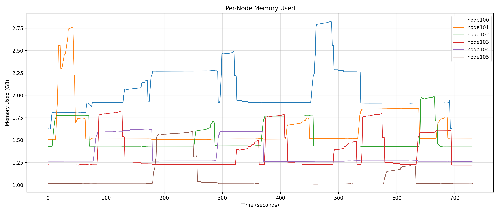
        <br>
        <em>MapReduce Memory使用</em>
      </td>
      <td align="center">
        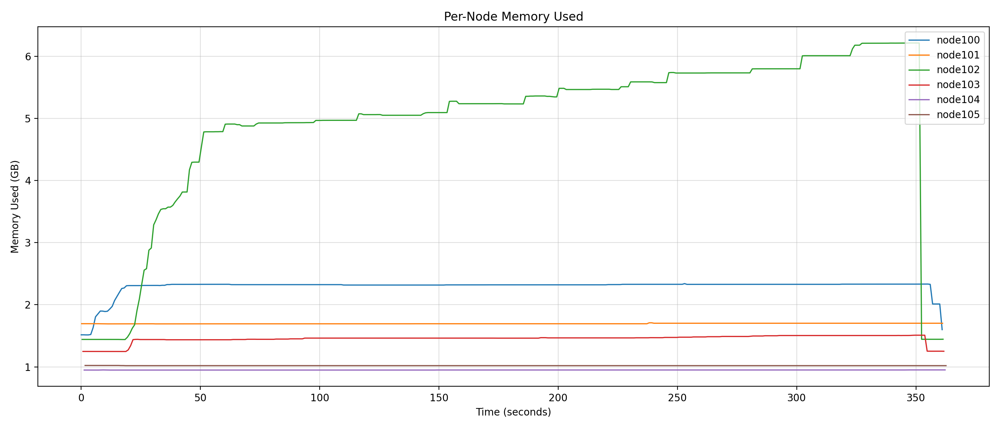
        <br>
        <em>Giraph Memory使用</em>
      </td>
    </tr>
  </table>
</p>


* **MapReduce：** 整体曲线呈现典型的“波浪形”，内存使用量反复震荡，形成密集的锯齿状波浪。由于MapReduce无法在内存中保留跨任务的数据，PageRank的每一次迭代都对应一个独立的Job。因此，系统必须反复经历“启动JVM -> 申请内存 -> 计算 -> Job结束销毁JVM/释放内存”的过程。每一次内存的“波谷”都代表了上一轮迭代的结束和状态的清空，下一轮必须重新从磁盘加载数据。
* **Giraph：** 整体曲线呈现“梯形”或“高位平稳”态势，这体现了Giraph有状态（Stateful）及内存驻留 的特性。系统只需在初始阶段将Slovakia图数据加载进内存一次，随后的所有计算超步都直接复用驻留在RAM中的图结构，无需反复读写磁盘或重启容器，直到整个应用彻底终止。

**总结：** 这两张图的形态差异直观地解释了性能差距：MapReduce的“波浪”意味着它在不断地“遗忘”并重新读取数据，将大量时间消耗在了I/O和进程启停上；而Giraph的“平稳”意味着它“记住”了数据，从而实现了比MapReduce快10倍以上的计算效率。


##### Giraph内存使用分析

<p align="center">
  <table>
    <tr>
      <td align="center">
        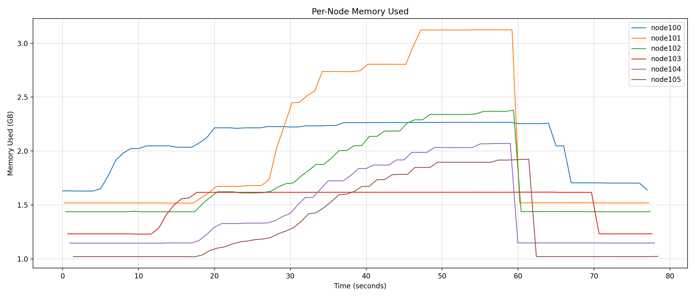
        <br>
        <em>(a) Giraph Memory使用 (Web-Google)</em>
      </td>
      <td align="center">
        
        <br>
        <em>(b) Giraph Memory使用 (soc-Pokec)</em>
      </td>
      <td align="center">
        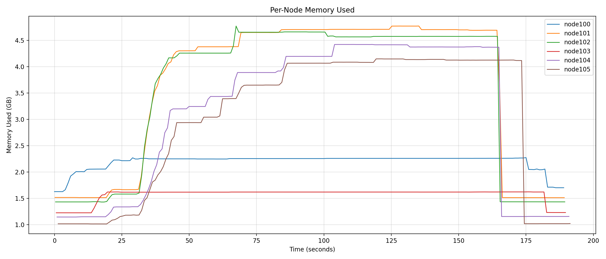
        <br>
        <em>(b) Giraph Memory使用 (LiveJournal)</em>
      </td>
    </tr>
  </table>
</p>

* **内存需求随图规模急剧上升:** 随着图数据规模扩大，Giraph 的内存消耗表现出明显的正相关性，但并非简单线性增长，而是受数据分布不均和算法迭代过程中的消息累积效应共同驱动，如图(a)、(b)、(c)所示。这种现象揭示了处理更大规模图数据集时面临的挑战：不仅要考虑存储图本身的数据，还需应对每轮迭代过程中产生的大量中间状态和消息缓存。
* **数据倾斜导致节点间内存负载严重不均：** 以图 (a)（Web-Google）为例，node101的内存使用量显著高于其他节点，在作业运行初期即迅速攀升并维持高位，而其余节点内存曲线相对平缓。这表明图分区过程中存在高度偏斜的顶点分配——部分高入度或高出度的“枢纽”顶点被集中分配至 node101，使其不仅需存储更多邻接边信息，还需在每轮超步中处理大量传入/传出消息。这种由真实网络图固有的幂律分布特性引发的计算与通信热点，是图计算系统面临的核心挑战之一，直接影响集群资源利用率与作业稳定性。


**数据倾斜分析**
<p align="center">
  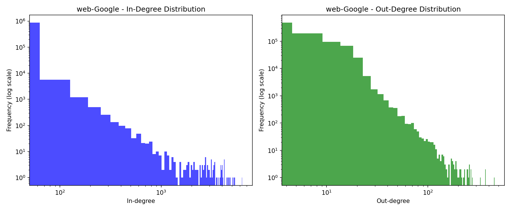
  <br>
  <em>Web-Google（小规模）的数据分布图</em>
</p>

<p align="center">
  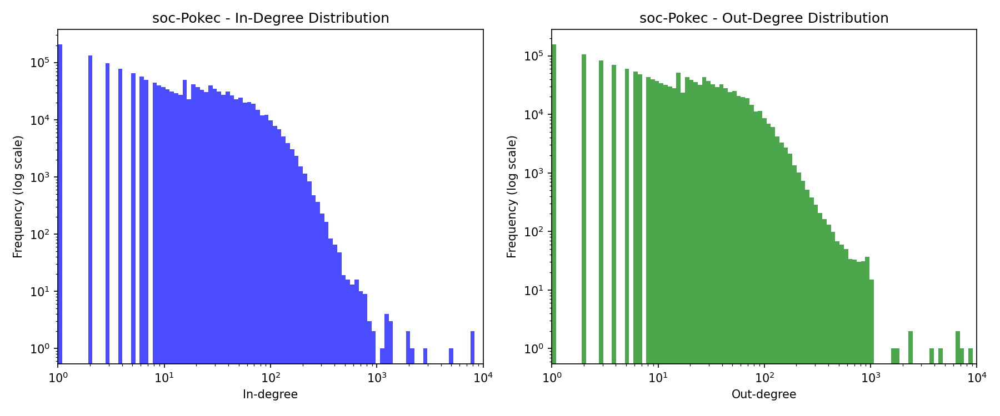
  <br>
  <em>soc-Pokec（中规模）的数据分布图</em>
</p>

<p align="center">
  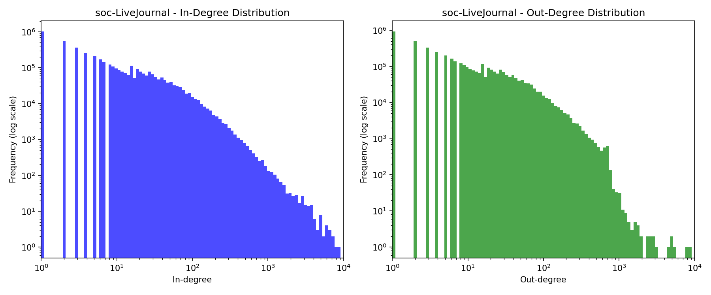
  <br>
  <em>LiveJournal（大规模）的数据分布图</em>
</p>


### 3.5 结论

* **Giraph 在图迭代计算中性能显著优于 MapReduce** 
  * 在小、中、大规模数据集上，Giraph 的总运行时间均远低于 MapReduce。
  * 这一差距主要源于 Giraph 的 内存驻留模型 和 BSP 同步机制，避免了 MapReduce 中每轮迭代必需的磁盘 I/O 与任务调度开销。
* **两者资源使用模式存在本质差异，体现不同的计算范式**
  * **MapReduce:** 采用无状态、离散式批处理模型：
    * 每次迭代需将中间结果写入 HDFS，并在下一轮重新读取，导致 高 I/O 开销 和 频繁的 JVM 启停；
    * 内存使用呈“波浪形”震荡，CPU 利用率阶段性波动，整体资源利用效率较低。
  * **Giraph：** 采用有状态、内存驻留的 BSP 模型：
    * 图结构一次性加载至内存，所有超步计算在 RAM 中完成，I/O 极低，计算密度高；
    * CPU 长时间处于高位运行，网络通信呈现高频脉冲特征，适合连续、同步的图遍历操作。
* **Giraph 对内存容量和图数据分布高度敏感，稳定性依赖于合理的资源配置** 
  * 实验显示，Giraph 的内存占用随图规模急剧上升，且因真实图数据普遍存在度分布偏斜（如超级节点），导致部分工作节点（如 node101）内存压力显著高于其他节点。
  * Giraph 缺乏磁盘溢写机制，一旦集群总内存不足以容纳整图及其消息队列，作业将直接失败，表现出“全有或全无”的特性，容错能力弱于 MapReduce。
* **适用场景不同，应根据实际需求理性选型**
  * **Giraph：** 图规模大（千万边以上）；需要多轮迭代计算；集群内存充足（建议单节点 ≥16 GB）。
  * **MapReduce:** 小规模验证；资源受限环境（内存紧张）；鲁棒性要求高于性能。

---

## 4. 小组分工

| 姓名        | 学号          | 具体工作与贡献                                                                        | 贡献度排序 |
|:----------|:------------|:-------------------------------------------------------------------------------| :--- |
| **王诗雨**   | 51285903056 | 1. 完成MapReduce PageRank算法代码<br>2. 对于系统资源监控进行详细分析<br>3. 辅助完成Giraph PageRank算法代码 | 1 |
| **[姓名B]** | [学号]        |                                                                                | 2 |
| **杜祥云**   | 51285903050 | 1. 完成迭代开销和数据规模扩展性测试分析<br>2. 完成PPT和讲稿制作<br>3. 录制介绍视频                            | 3 |
| **[姓名D]** | [学号]        |                                                                                | 4 |